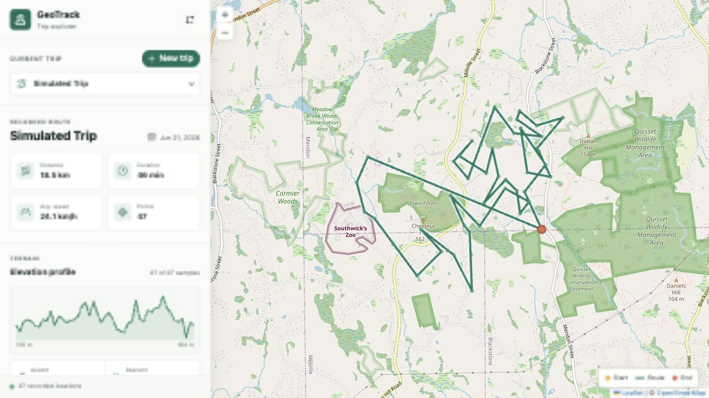
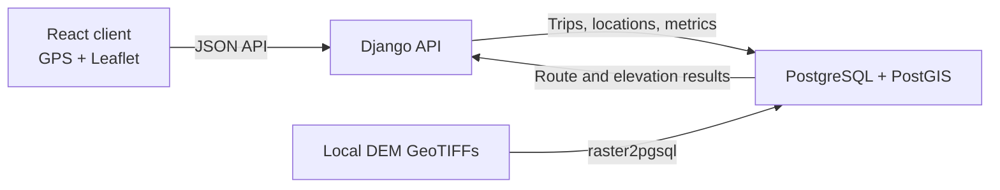
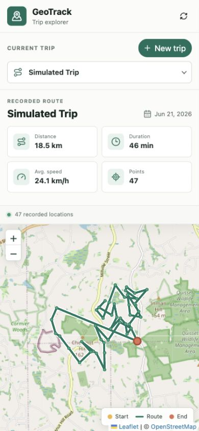

# GeoTrack

GeoTrack is a self-hosted trip recorder and geospatial dashboard. It records
browser GPS positions, stores them in PostGIS, renders routes with Leaflet, and
derives distance, speed, and DEM-backed elevation metrics.



## Features

- Start, record, and finish a trip from the browser
- Store GPS locations as PostGIS `Point` geometries in EPSG:4326
- Display recorded routes, start/end points, and trip selection on a Leaflet map
- Calculate distance, duration, and average speed
- Calculate elevation profiles, ascent, and descent from imported DEM rasters
- Report full, partial, unavailable, or pending DEM coverage
- Seed a complete simulated trip for local development
- Inspect spatial tables and route views in QGIS
- Run the complete stack with Docker Compose

## Stack

| Layer | Technology |
| --- | --- |
| Client | React 19, TypeScript, Vite, HeroUI |
| Mapping | React Leaflet, Leaflet, OpenStreetMap |
| API | Django 6 |
| Database | PostgreSQL 14, PostGIS 3.5, PostGIS Raster |
| Runtime | Docker Compose |

## Architecture



The browser never parses the DEM files. Django queries raster values from
PostGIS for each recorded location. Route, distance, and speed work without DEM
coverage; only elevation profile, ascent, and descent depend on the raster data.

## Prerequisites

- Docker Desktop with Docker Compose
- DEM GeoTIFF files for the geographic area where elevation metrics are needed
- A browser that supports the Geolocation API for live trip recording

## Configuration

Create a `.env` file in the repository root:

```dotenv
POSTGRES_USER=geotrack
POSTGRES_PASSWORD=change-me
POSTGRES_DB=geo_track_db

DEM_SRID=26918
DEM_TABLE=public.elevation
DEM_TILE_SIZE=100x100
```

`DEM_SRID` must describe the actual coordinate system of the source TIFFs.
Confirm it with `gdalinfo` rather than relying only on a filename or download
page. The included New England DEM data uses EPSG:26918.

Do not commit production credentials in `.env`.

## DEM Files

Place one or more `.tif` or `.TIF` files in:

```text
dem/
```

The TIFF contents are intentionally excluded from Git while `dem/.gitignore`
keeps the directory in the repository.

During initial database creation, `scripts/20-load-dem.sh`:

1. Enables PostGIS raster support.
2. Finds all TIFF files mounted at `/dem`.
3. Tiles each raster using `DEM_TILE_SIZE`.
4. Loads the tiles into `DEM_TABLE`.
5. Creates raster constraints and spatial indexes.

The default `100x100` tile size is a practical starting point for point sampling
and small-area raster queries.

## Run

Build and start the stack:

```bash
docker compose up --build
```

Or run it in the background:

```bash
docker compose up --build -d
```

Services:

| Service | URL |
| --- | --- |
| React client | http://localhost:3000 |
| Django API | http://localhost:8080 |
| PostGIS | `localhost:5432` |

The first database initialization can take time because the DEM files are tiled
and imported before Postgres finishes starting.

## Database Initialization

Postgres runs files in `/docker-entrypoint-initdb.d` only when it creates a new
database volume.

The initialization scripts are:

- `scripts/15-init-locations.sql`: extensions, trip/location tables, route view,
  and simulated trip
- `scripts/20-load-dem.sh`: tiled DEM raster import

To recreate everything from scratch:

```bash
docker compose down -v
docker compose up --build
```

This deletes the local database volume.

To rerun the trip and location initializer without deleting the volume:

```bash
docker compose exec -T database sh -c \
  'psql -U "$POSTGRES_USER" -d "$POSTGRES_DB" -v ON_ERROR_STOP=1 \
  -f /docker-entrypoint-initdb.d/15-init-locations.sql'
```

The initializer replaces the trip named `Simulated Trip` but leaves other trips
untouched.

## Trip Recording

1. Open http://localhost:3000.
2. Select **New trip**.
3. Enter a trip name.
4. Allow browser location access.
5. Keep the application open while recording.
6. Select **Finish trip** when done.

Only one active trip is allowed because the application currently targets a
single user. Each GPS sample stores longitude, latitude, timestamp, and reported
accuracy.

Geolocation generally requires `localhost` or HTTPS. Production deployments
should serve the client over HTTPS.

<p align="center">
  
</p>

## Metrics

The dashboard computes:

- Total distance in kilometers using `ST_DistanceSphere`
- Trip duration from the first and last location timestamps
- Average speed in kilometers per hour
- Route geometry using `ST_MakeLine`
- Elevation samples using `ST_Value`
- Total ascent and descent from consecutive elevation deltas

Elevation coverage states:

| State | Meaning |
| --- | --- |
| `available` | Every recorded location has a DEM sample |
| `partial` | Only part of the route overlaps the loaded DEM |
| `unavailable` | Locations exist, but none overlap the DEM |
| `pending` | The trip does not have any locations yet |

Unavailable ascent and descent are returned as `null` and displayed as `—`, not
as a fabricated zero.

## API

All endpoints are rooted at `/api`.

| Method | Endpoint | Purpose |
| --- | --- | --- |
| `GET` | `/trips/` | List trips |
| `POST` | `/trips/` | Start an active trip |
| `GET` | `/trips/{id}/` | Get trip metadata |
| `PATCH` | `/trips/{id}/` | Complete a trip |
| `GET` | `/trips/{id}/locations/` | List recorded locations |
| `POST` | `/trips/{id}/locations/` | Add a GPS location |
| `GET` | `/trips/{id}/route/` | Get the route as GeoJSON |
| `GET` | `/trips/{id}/metrics/` | Get distance and speed metrics |
| `GET` | `/trips/{id}/elevation-profile/` | Get sampled elevations |
| `GET` | `/trips/{id}/elevation-summary/` | Get ascent, descent, and coverage |

Start a trip:

```bash
curl -X POST http://localhost:8080/api/trips/ \
  -H "Content-Type: application/json" \
  -d '{"name":"Morning Ride","startedAt":"2026-06-21T12:00:00Z"}'
```

Add a location:

```bash
curl -X POST http://localhost:8080/api/trips/TRIP_ID/locations/ \
  -H "Content-Type: application/json" \
  -d '{
    "latitude":42.0642992,
    "longitude":-71.5550657,
    "accuracyM":5,
    "recordedAt":"2026-06-21T12:01:00Z"
  }'
```

Finish a trip:

```bash
curl -X PATCH http://localhost:8080/api/trips/TRIP_ID/ \
  -H "Content-Type: application/json" \
  -d '{"status":"completed","endedAt":"2026-06-21T13:00:00Z"}'
```

## QGIS

Create a PostgreSQL connection with:

```text
Host: localhost
Port: 5432
Database: value of POSTGRES_DB
Username: value of POSTGRES_USER
Password: value of POSTGRES_PASSWORD
```

Useful layers:

- `public.locations`: recorded point geometries
- `public.trip_routes`: generated trip line geometries
- `public.elevation`: tiled DEM raster data

Enable **Also list tables with no geometry** to inspect `public.trips`.
If `trip_routes` is not shown, enable **Use estimated table metadata** and
reconnect. The view exposes `qgis_id` as a stable feature identifier.

## Development

Client checks:

```bash
cd src/client
npm install
npm run lint
npm run build
```

Django checks inside Docker:

```bash
docker compose exec backend python manage.py check
docker compose exec backend python manage.py showmigrations
```

View service logs:

```bash
docker compose logs -f frontend backend database
```

## Project Structure

```text
.
├── dem/                         # Local GeoTIFF files, excluded from Git
├── docs/images/                 # README screenshots
├── scripts/
│   ├── 15-init-locations.sql    # Spatial schema and simulated trip
│   └── 20-load-dem.sh           # Raster import
├── src/
│   ├── client/                  # React application
│   └── server/                  # Django API
├── compose.yaml
└── Dockerfile                   # PostGIS image with raster2pgsql
```

## Current Limitations

- Single-user operation with one active trip at a time
- Local DEM coverage is limited to the TIFFs placed in `dem/`
- DEM files are imported into PostGIS rather than streamed from cloud storage
- Browser recording requires the application to remain open
- The Docker and Django servers are currently configured for development

A future deployment can replace the local raster import with Cloud Optimized
GeoTIFFs in object storage and a service such as TiTiler, while continuing to use
PostGIS for trips and locations.
